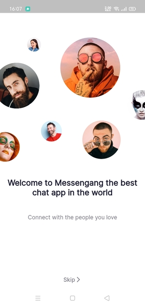
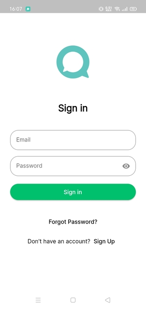
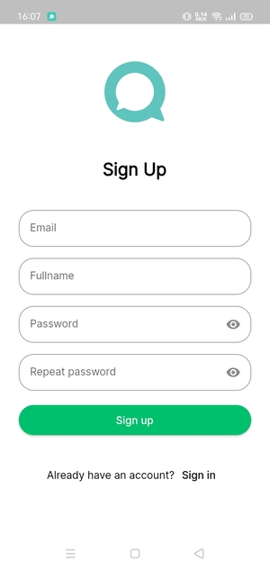
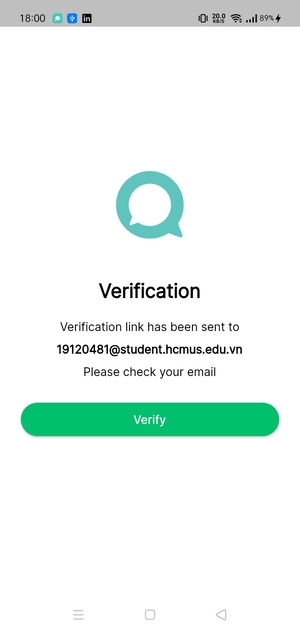
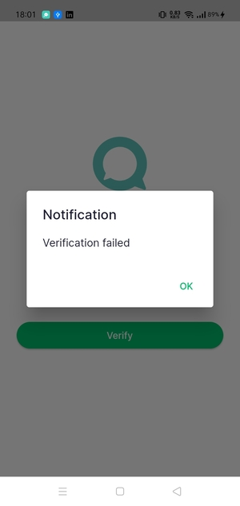
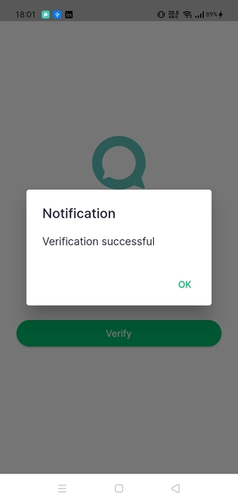
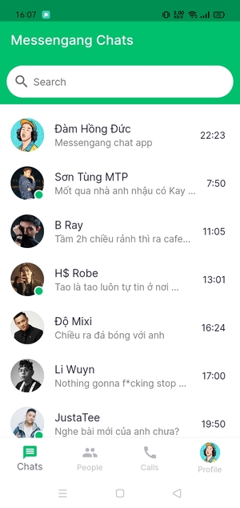
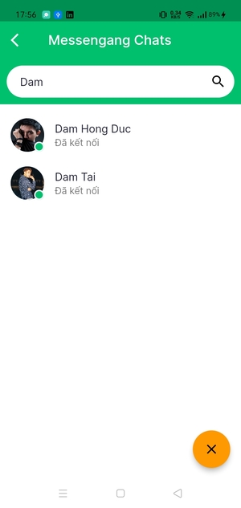
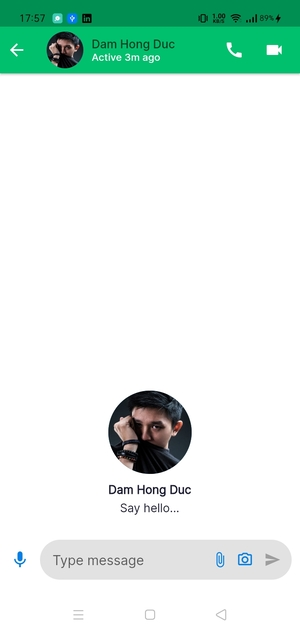
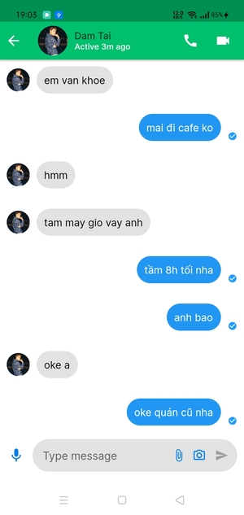

# Messengang
- Personal project
- Chat App
# Technologies
- Flutter
- Firebase
- State management: Provider
# Android (file .apk)

# Demo

# Screenshots

<kbd>
  
  &nbsp;&nbsp;&nbsp;&nbsp;&nbsp;&nbsp;&nbsp;&nbsp;
  
</kbd>
 
 

<kbd>
  
  &nbsp;&nbsp;&nbsp;&nbsp;&nbsp;&nbsp;&nbsp;&nbsp;
  
</kbd>
   
   

<kbd>
  
  &nbsp;&nbsp;&nbsp;&nbsp;&nbsp;&nbsp;&nbsp;&nbsp;
  
</kbd>
   
   

<kbd>
   
  &nbsp;&nbsp;&nbsp;&nbsp;&nbsp;&nbsp;&nbsp;&nbsp;
  
</kbd>
   
   

<kbd>
  
  &nbsp;&nbsp;&nbsp;&nbsp;&nbsp;&nbsp;&nbsp;&nbsp;
    
</kbd>
